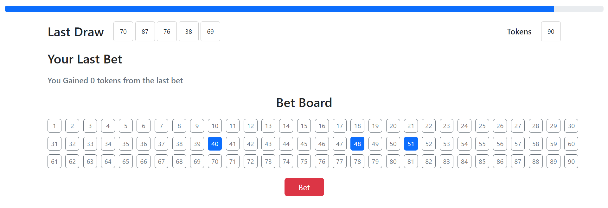

## React Client Application Routes

- route(`/`) : page were to bet and see the result or game rules if not logged in
- route(`/top3`) : shows top3 list ranked or game rules if not logged in 
- route(`/login`) : shows login form


## API Server

### - POST `/api/bet`
- **Description:** sends user's bet
- **Request body:**
  ```json  
  {"bet": [1,2,3]}
- **Response:** 
    - `200 OK`  
    - `403 not enough tokens to bet`
    - `422 validation error`
    - `500 iinternal server error`
- **Response body:**
  ```json 
  {
    "userId": "1",
    "tokens": "tokens", 
    "bet": [1,2,3]
  }

### - GET `/api/round`
- **Description:** send's round result for the user
- **Request body:**
- **Response:** 
    - `200 OK`  
    - `500 iinternal server error`
- **Response body:**
  ```json 
  {
    "draw": [15,69,19,38,23],
    "bet": [1,2],
    "timestamp": "2024-09-14 00:18:54",
    "tokens": 20,
    "gainedTokens": 0
  }

### - GET `/api/top3`
- **Description:** send's top3 ranked
- **Request body:**
- **Response:** 
    - `200 OK`  
    - `500 iinternal server error`
- **Response body:**
  ```json 
  [
    {
      "id": 4,
      "name": "Matteo",
      "surname": "Aranci",
      "tokens": 105
    },
    {
      "id": 5,
      "name": "Luigi",
      "surname": "Neri",
      "tokens": 35
    },
    {
      "id": 3,
      "name": "Giulio",
      "surname": "Verdi",
      "tokens": 5
    }
  ]

### - POST `/api/session`
- **Description:** autenticates user
- **Request body:** None
- **Response:** 
    - `201 OK`  
    - `401 invalid credentials`
- **Response body:**
  ```json 
  {
    "id": 1,
    "username": "user1",
    "name": "Mario",
    "surname": "Rossi",
    "tokens": "100"
  }

### - GET `/api/session/current`
- **Description:** checks if user is authenticated
- **Request body:** None
- **Response:** 
    - `201 OK`  
    - `401 not autheticated`
- **Response body:**
  ```json 
  {
    "id": 1,
    "username": "user1",
    "name": "Mario",
    "surname": "Rossi",
    "tokens": "100"
  }

### - DELETE `/api/session/current`
- **Description:** unlogs user
- **Request body:** None
- **Response:** None
- **Response body:** Non

## Database Tables

- Table `users` - contains 
  id	username	name	surname	tokens	password	salt
  contains users informations and their hashed credentials

- Table `draws` - contains 
  id	timestamp int1 int2 int3 int4 int5
  contains draws and their timestamp

- Table `bets` - contains 
  userId drwaId n1 n2 n3 
  contains the bet made by each user in each draw

## Main React Components

- `LoginForm` (in `AuthComponents.jsx`): handles form to login 
- `LogoutBotton` (in `AuthComponents.jsx`): handles button to logout
- `Navheader` (in `NavHeader.jsx`): handles Navbar of the site
- `GameRules` (in `GameRules.jsx`): just an explanation of game rules for unlogged users
- `Ranking` (in `Ranking.jsx`): shows top3 users
- `Timer` (in `Timer.jsx`): handles 2 minutes timer
- `Betboard` (in `BetBoard.jsx`): handles the board to select numbers to bet 
- `Game` (in `Game.jsx`): contains timer, betboard and betting result

(only _main_ components, minor ones may be skipped)

## Screenshot



## Users Credentials

- (user1, password1) 
- (user2, password2)
- (user3, password3)
- (user4, password4)
- (user5, password5)

